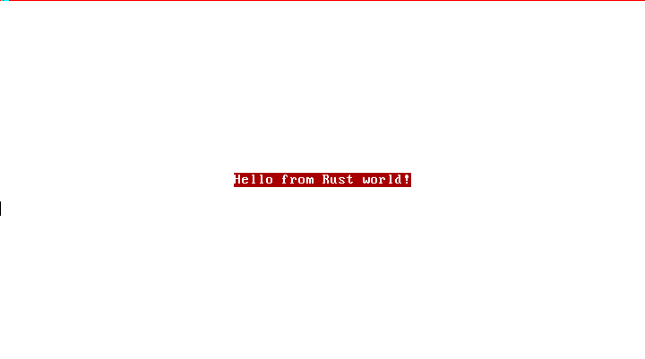

# Nucleus

This is a small hobby OS, written in Rust. It is not particularly serious. I’m
not yet at the point where I have to actually worry about design decisions, so
we’ll see what it ends up like.

http://jvns.ca/blog/2014/03/12/the-rust-os-story/ is a wonderful example of the
spirit of this project. The Rust bits are outdated, the “Let’s learn things!
Learning is great!” attitude is very much not.



Resources:

* http://wiki.osdev.org/
* http://pages.cs.wisc.edu/~remzi/OSTEP/
* http://blog.phil-opp.com/rust-os/multiboot-kernel.html
* http://www.randomhacks.net/bare-metal-rust/

## Building

Make sure you have a nightly Rust. Any recent nightly should do. Other requirements:

* `nasm`
* `ld`
* `grub-mkrescue`
* `qemu-system-x86_64`

If you have all that, it’s time to deal with `libcore`. Until [this
issue](https://github.com/rust-lang/rfcs/issues/1364) is resolved, you’ll need
to build your own `libcore`.

To do that, you can either use
[`nightly-libcore`](https://github.com/phil-opp/nightly-libcore), or do this:

```bash
$ git clone https://github.com/rust-lang/rust.git
$ cd rust
```

Then apply [this
patch](https://github.com/thepowersgang/rust-barebones-kernel/blob/master/libcore_nofp.patch).

Afterwards:

```
$ cd ..
$ mkdir -p build
$ rustc --target x86_64-unknown-nucleus-gnu -Z no-landing-pads \
    --cfg disable_float \
    --out-dir build/ \
    rust/src/libcore/lib.rs
```

Now, you have a `build/libcore.rlib` file. It needs to be in a place `Cargo`
can find it. I use [`multirust`](https://github.com/brson/multirust), so for
me:

```
$ mkdir -p ~/.multirust/toolchains/nightly/lib/rustlib/x86_64-unknown-nucleus-gnu/lib
$ cp build/libcore.rlib ~/.multirust/toolchains/nightly/lib/rustlib/x86_64-unknown-nucleus-gnu/lib
```

Whew! Hopefully this won’t be a big deal in the future. For a writeup on why
this is needed, see [this
post](http://www.randomhacks.net/2015/11/11/bare-metal-rust-custom-target-kernel-space/).

After all that setup, it’s as easy as:

```bash
$ make run
```

This will:

* Build the Rust code with Cargo
* Compile the bit of assembly needed to boot
* Link it all together
* Build an ISO out of it all
* Run that ISO in qemu
